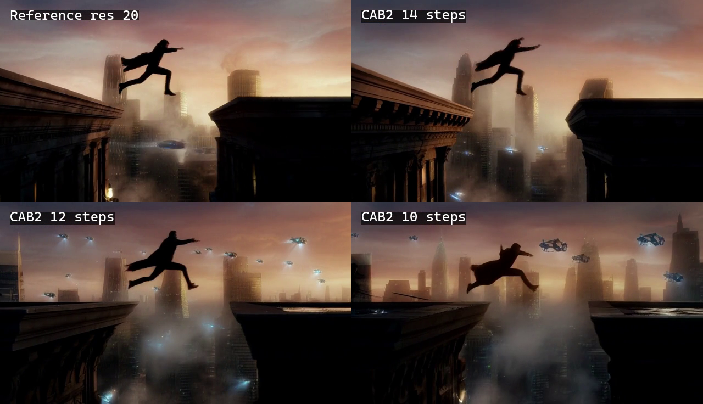

# MiniMax H3 ComfyUI 优化节点评估报告

评估日期：2026-08-11  
状态：实验性公开预览

## 1. 结论摘要

本轮开发得到的优化并不是单一“万能加速开关”，而是三条可以独立组合的路线：

1. **全步数精确优化**：1280×736、5秒、20步实测中，NVFP4 Fused MLP
   将 denoise 从 208.756 秒降至 194.079 秒（-7.03%），完整生成从
   244.969 秒降至 223.674 秒（-8.69%），peak allocated VRAM 同时减少
   712.246 MiB，最终视频像素 SSIM=1、PSNR=∞，latent hash 完全一致。
2. **显存优化**：在 Fused MLP 基础上，Low-Memory Sage2 将峰值从
   4410.209 MiB 进一步降至 3843.612 MiB（-566.597 MiB）；相对未融合的
   Sage2 基准累计减少 1278.843 MiB。代价是相对 Fused+Sage2 慢 2.13%。
3. **低步数优化**：相对 Fused+Sage2 20步，CAB-2 12步的 denoise 减少
   39.79%，完整生成减少34.46%，视频 SSIM=0.8153、PSNR=20.24 dB；
   CAB-2 10步则分别减少49.79%与43.23%，SSIM=0.8060、PSNR=19.02 dB。

对于官方默认 20 步，推荐优先使用：

- 稳妥速度：`exact_speed + res_multistep + stock_simple + 20 steps`
- 显存压力：`exact_low_vram + res_multistep + stock_simple + 20 steps`

CAB 更适合用14、12、10步换取不同幅度的速度提升，而不是在相同20步上期待
直接加速。单个样本中14步最接近20步参考，但仍需更大的prompt/seed回归集。

## 2. 测试环境

| 项目 | 配置 |
|---|---|
| GPU | NVIDIA GeForce RTX 5070 Ti 16 GB，Blackwell SM 12.0 |
| 系统内存 | 约 48 GiB，可用共享 GPU 内存约 24 GB |
| 操作系统 | Windows |
| ComfyUI | 0.31.0 |
| Python | 3.12.9 |
| PyTorch | 2.10.0+cu130 |
| comfy-kitchen | 0.2.28 |
| Triton | 3.6.0 |
| UNet | `MiniMax_H3_FL2VA_pruned_nvfp4.safetensors` |
| Text encoder | `qwen3vl_32b_minimax_h3_nvfp4_awq.safetensors` |
| Video VAE | `minimax_h3_video_vae_fp16.safetensors` |
| Audio VAE | `minimax_h3_audio_vae_fp32.safetensors` |

主要测试为文生视频，最多一张图像参考。测试分辨率覆盖约 480p 与
1280×736，典型时长 5 秒。不同实验尽量固定 prompt、seed、分辨率、时长、
模型和 sigma 调度。

## 3. 测试方法

### 3.1 时间测量

- 区分冷启动、模型初始化和暖机采样。
- 主要比较进度条中的 denoise 时间，桌面显示的完整时间还包含文本编码、
  模型换入、VAE 解码和视频封装。
- 小幅差异需要多次交错测试，避免动态显存加载、编译缓存和后台任务造成误判。

### 3.2 数值一致性

- 对声频与视频 latent 的所有 tensor 生成独立 SHA-256，并生成 combined hash。
- “精确”表示在当前硬件、软件版本和选定 Sage2 路径下 latent hash 一致，
  不代表跨 GPU、跨 PyTorch 或跨 kernel 实现必然 bit-exact。

### 3.3 低步数质量

- 以相同 prompt/seed 的 Fused+Sage2、`res_multistep` 20步输出作为轨迹参考。
- 比较解码视频帧的 SSIM 和 PSNR。
- 指标只能描述对本次参考输出的接近程度，不能替代对运动、人物结构、剪辑、
  音频和提示词遵循度的主观评估。

## 4. 分项结果

### 4.1 H3 NVFP4 Fused MLP

原生 H3 MLP 会先形成较大的 BF16/FP16 SwiGLU 激活，再为 FC2 进行 NVFP4
量化。Fused MLP 将激活与 FC2 输入量化融合，继续调用 comfy-kitchen 的原生
NVFP4 GEMM，不跳过 block，也不减少采样步数。

实测结果：

- 1280×736 workload：每次 MLP 调用避免约 952.7 MiB 的大型 BF16/FP16
  中间激活。
- 约 0.2 MP 烟雾测试：每次 MLP 调用避免约 82.7 MiB 中间激活。
- 20步 denoise：208.756秒 → 194.079秒，提升7.03%。
- 20步完整生成：244.969秒 → 223.674秒，提升8.69%。
- peak allocated：5122.455 MiB → 4410.209 MiB，减少712.246 MiB。
- combined latent SHA-256一致；解码视频SSIM=1、PSNR=∞。

判断：在本次20步长序列中，Fused MLP同时带来了可测量的速度与峰值显存收益，
并且是当前风险最低、最适合默认开启的优化。

### 4.2 H3 Low-Memory Sage2

该实现重新组织 Sage2 attention 的 Q/K 量化和 PV 路径，降低临时 workspace，
不改变采样步数。

| 指标 | Fused + Sage2 | Fused + Low-Memory Sage2 | 差值 |
|---|---:|---:|---:|
| 20步 denoise | 194.079 s | 198.212 s | +4.133 s |
| denoise peak allocated | 4410.209 MiB | 3843.612 MiB | -566.597 MiB |

- 降幅约 12.9%。
- combined latent SHA-256 一致。
- 相对Fused+普通Sage2慢2.13%，但仍比未融合Sage2基准快5.05%。
- 显存减少是峰值 headroom，不会因为 20 步变成 20 倍；它主要降低高分辨率、
  长视频或系统共享显存介入时的失败风险。

判断：显存临界时价值高；显存充足、只追求速度时使用普通 Sage2 更合适。

### 4.3 H3 CAB Low-Step Sampler

CAB-2/CAB-3 是 training-free 多步求解器，复用历史 velocity 并进行 defect
correction，不增加每一步中的模型调用。该节点按照 CAB 论文方程独立适配了
ComfyUI denoised-output 约定和 H3 的音视频 NestedTensor。

早期以10步输出为参考的6步试验：

| 分辨率/时长 | 6步方法 | SSIM | PSNR |
|---|---|---:|---:|
| 约 480p / 5秒 | res_multistep | 0.7902 | 19.62 dB |
| 约 480p / 5秒 | CAB-2 | 0.8155 | 20.63 dB |
| 1280×736 / 5秒 | res_multistep | 0.8017 | 20.09 dB |
| 1280×736 / 5秒 | CAB-2 | 0.8270 | 21.26 dB |

- 两种 6 步方法都是 6 次模型调用；相对 10 步减少 40% NFE。
- CAB 自身算术开销低于 denoise 时间的 1%。
- CAB 历史状态在 736p 下比 `res_multistep` 多约 112 MiB 峰值占用。
- CAB-2 在此次样本上略优于 CAB-3，`theta=0.20` 是当前验证默认值。
- CAB-2 6 步仍不等于 10 步质量，更不能由此推导为等于官方 20 步质量。

本次新增的1280×736、5秒、20步参考试验：

| 方法 | Denoise | 完整生成 | Peak MiB | SSIM/PSNR（对20步） |
|---|---:|---:|---:|---:|
| res 20参考 | 194.079 s | 223.674 s | 4410.209 | 1.0000 / ∞ |
| CAB-2 14步 | 136.763 s | 137.504 s（未解码） | 4522.856 | 0.8274 / 21.66 dB |
| CAB-2 12步 | 116.859 s | 146.589 s | 4522.856 | 0.8153 / 20.24 dB |
| CAB-2 10步 | 97.438 s | 126.983 s | 4522.856 | 0.8060 / 19.02 dB |

CAB-14第一次运行发生一次61秒首步加载异常；随后无解码暖机复测为136.763秒，
并得到相同latent hash。表格采用暖机复测的denoise数据。

判断：CAB的速度基本随NFE线性下降，代价是约112.647 MiB历史状态显存和逐渐
偏离20步轨迹。本样本14步最接近参考；12步提供更激进但仍可辨认的折中。



[下载CAB 20/14/12/10步 2×2对比视频](benchmark_artifacts/media/cab_lowstep_2x2.mp4)

### 4.4 H3 Low-Step Sigmas

- `stock_simple` 精确复现 ComfyUI simple scheduler 的离散索引和 H3 原生 shift。
- `balanced_late`、`strong_late` 和自定义 late bias 在当前样本上均未优于
  `stock_simple`。

判断：保留为研究接口，但生产默认应使用 `stock_simple`。

### 4.5 两个统一入口节点

新增：

- `H3 Optimization Controller`
- `H3 Optimized Sampling`

控制器只编排独立插件，不复制 CUDA/Triton kernel。它会检测重复 attention
override，并将 `steps` 直接输出给采样节点，防止求解器步数与 sigma 步数不一致。

真实烟雾测试：

- 约 0.2 MP、约 1.6 秒、2 步、CAB-2、stock simple。
- `exact_low_vram` 完整执行成功，冷启动完整耗时 27.13 秒。
- `exact_speed` 暖机完整耗时 1.07 秒。
- 两次 combined latent SHA-256 均为
  `68379847125b82e3fb35b3f6c9f7a75d2b635f7e1293a2421c28ef3a071d4d3c`。

27.13 秒与 1.07 秒不能作为两个预设的速度对比，因为前者包含模型冷初始化；
该测试的意义是验证端到端编排以及两条精确路径的数值一致性。

## 5. 官方 20 步下的适用性

完整矩阵（固定prompt/seed，1280×736，约5.17秒）：

| 配置 | 步数 | Denoise | 完整生成 | Peak MiB | SSIM/PSNR |
|---|---:|---:|---:|---:|---:|
| Stock KJ Sage2 | 20 | 208.756 s | 244.969 s | 5122.455 | 1.0000 / ∞ |
| Fused + Sage2 | 20 | 194.079 s | 223.674 s | 4410.209 | 1.0000 / ∞ |
| Fused + LowMem Sage2 | 20 | 198.212 s | 228.359 s | 3843.612 | 1.0000 / ∞ |
| Fused + CAB-2 | 14 | 136.763 s | 137.504 s（未解码） | 4522.856 | 0.8274 / 21.66 dB |
| Fused + CAB-2 | 12 | 116.859 s | 146.589 s | 4522.856 | 0.8153 / 20.24 dB |
| Fused + CAB-2 | 10 | 97.438 s | 126.983 s | 4522.856 | 0.8060 / 19.02 dB |

| 组件 | 20 步作用 | 建议 |
|---|---|---|
| Fused MLP | 每一步生效，绝对节省时间累计增加 | 默认开启 |
| exact Sage2 | 保持测试路径数值一致 | 日常默认 |
| Low-Memory Sage2 | 峰值显存下降，但不是按步数累计 | 显存临界时开启 |
| CAB-2 | 同为 20 步时不减少 NFE | 用于尝试降低到 14/12/10 步 |
| biased sigmas | 当前没有正向证据 | 保持 stock simple |

## 6. 16 GB 长序列显存保护试验

新增的 `H3 Long-Sequence VRAM Optimizer` 面向“普通 5 秒工作流能跑、但更长或更高
分辨率突然 OOM”的情况。它不减采样步数、不切割视频时间轴，并且在短序列上自动
bypass。节点组合了三种手段：

- 为 ComfyUI DynamicVRAM 预留激活空间，减少常驻权重挤占；
- 分块计算专用 H3 Turbo LoRA bypass delta；
- 仅在显式 `16gb_chunked` 模式中，按 token 行分块计算 H3 MLP。

极限烟雾测试固定为 `1376×768 / 362 帧（约 15 秒）/ 4 步`，使用 NVFP4 UNet、
专用 Turbo LoRA、accurate Fused MLP 与 Low-Memory Sage2。为单独验证 denoise，
测试输出接到 latent sink，没有执行 Video/Audio VAE 解码。

| 配置 | 结果 | 关键显存变化 | 时间 |
|---|---|---|---:|
| `16gb` 精确模式 | OOM | LoRA qkv 临时量 4579.8 → 252.0 MiB，但原生 NVFP4 MLP 峰值仍超限 | 未完成 |
| `16gb_chunked`, `4096/256` | 完整跑完 | MLP FC1 临时量上界 6106.4 → 224.0 MiB；LoRA 临时量约 252 MiB | denoise 约 341.8 s；完整 prompt 351.66 s |

分块尺寸探索没有发现更快的大块配置：`8192/384` 的两步平均为 86.33 s/步，
`12288/448` 为 86.44 s/步；默认 `4096/256` 的四步平均为 85.44 s/步。因此当前
默认保留更稳妥的 `4096/256`，不以额外峰值显存交换不存在的吞吐收益。
[原始长序列结果表](benchmark_artifacts/raw/long_sequence_16gb_results.csv)
保留了各配置、步数和测试边界。

需要特别区分两类数值语义：`auto`、`16gb`、`24gb_plus` 不分块基础 NVFP4 MLP，
适合作为精确路径；`16gb_chunked` 会让 NVFP4 对每个 chunk 单独推导动态输入 scale，
因此可能与未分块结果存在小数值差异。它是“原本会 OOM 时让任务完成”的兜底，
不是普通短视频的加速开关。本轮尚未对 15 秒输出做 VAE 解码和画质回归，不能把
“denoise 成功”扩大表述成完整长视频流程已验证。

## 7. 推荐配置

### 7.1 当前KJ Sage2质量对照

```text
preset: exact_speed
fused_mlp: false
sampler: res_multistep
sigmas: stock_simple
steps: 20
```

### 7.2 精确速度优先

```text
preset: exact_speed
sampler: res_multistep
sigmas: stock_simple
steps: 20
```

### 7.3 高分辨率/长时长显存优先

```text
preset: exact_low_vram
sampler: res_multistep
sigmas: stock_simple
steps: 20
```

### 7.4 低步数实验

```text
preset: exact_speed
sampler: CAB-2
theta: 0.20
sigmas: stock_simple
steps: 14 -> 12 -> 10，逐档对比20步参考
```

低步数测试使用精确 Sage2 attention。

### 7.5 16 GB 极限长序列兜底

```text
profile: 16gb_chunked
mlp_chunk_rows: 4096
lora_chunk_mib: 256
manual_reserve_gib: 0
```

先尝试精确的 `auto` 或 `16gb`；只有仍然 OOM 时才切换到
`16gb_chunked`。该节点应放在 Turbo LoRA、Fused MLP、Sage2 等模型补丁之后，
guider/sampler 之前。

## 8. 局限与后续工作

当前结果不能视为通用 benchmark，原因包括：

- 质量对比主要来自一个 prompt 和一个 seed。
- SSIM/PSNR 衡量的是对参考轨迹的接近度，不等同于审美质量。
- 已完成单prompt/seed的20步参考与CAB 10/12/14步矩阵，但尚未形成大样本统计。
- 尚未覆盖对白、复杂手部、多人交互、快速剪辑、强音画同步等高难度内容。
- Blackwell 以外仅验证了 Low-Memory Sage2 的设计兼容范围，没有完整实机矩阵。
- CAB-14捕获到一次61秒首步异常，说明动态权重加载和
  缓存状态仍会污染单次完整耗时；报告因此采用了相同hash的暖机复测denoise值。
- 15秒长序列仅验证了 denoise 能完成，尚未验证完整 VAE 解码、最终视频质量，
  也没有把 `16gb_chunked` 标记为数值精确路径。

建议后续建立 8–12 个固定 prompt、至少 3 个 seed 的回归集，分别记录：

- denoise time、完整 prompt time、NFE；
- peak allocated/reserved VRAM 与 Windows shared GPU memory；
- latent hash、逐帧 SSIM/PSNR/VMAF；
- 人物结构、运动连续性、提示词遵循、音画同步的盲评结果。

## 9. 外部参考

- CAB paper: <https://arxiv.org/abs/2605.16736>
- CAB official implementation: <https://github.com/Anuska-Roy/CAB>
- SageAttention: <https://github.com/thu-ml/SageAttention>
- ComfyUI: <https://github.com/Comfy-Org/ComfyUI>
- T8 MiniMax H3 audio/Turbo workflow: <https://github.com/T8mars/comfyui-minimax-h3-audio-T8>
